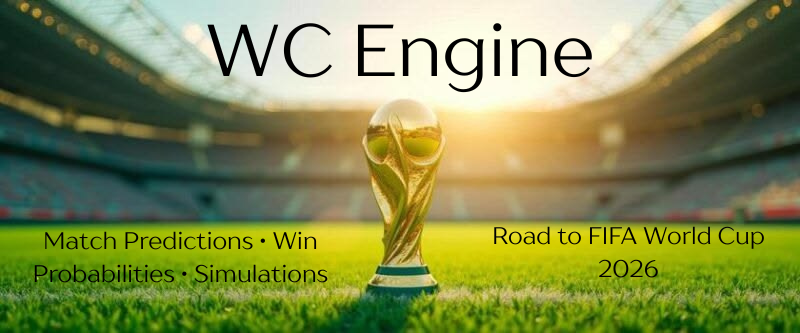
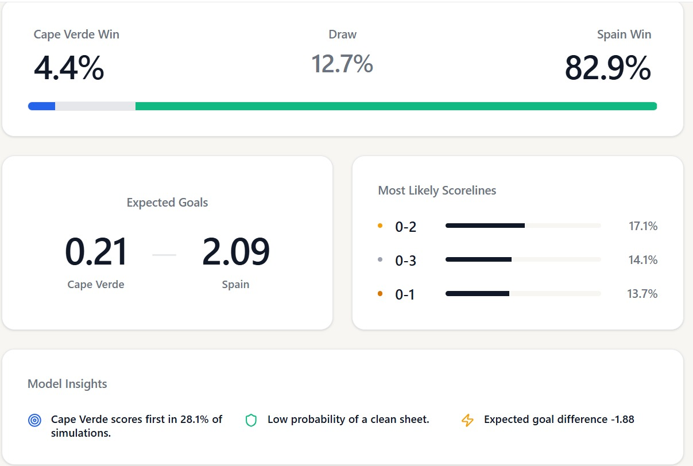
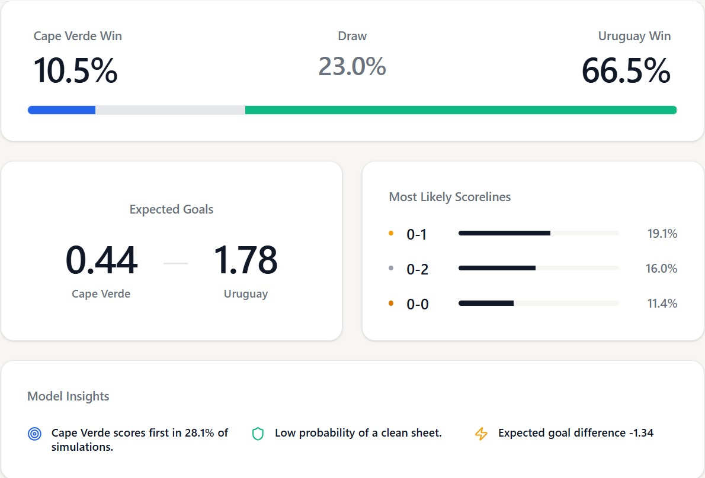
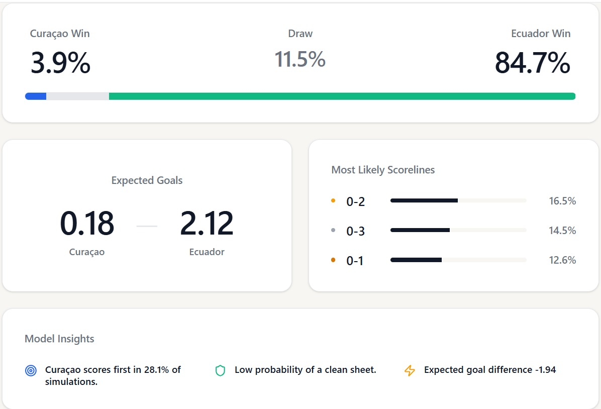
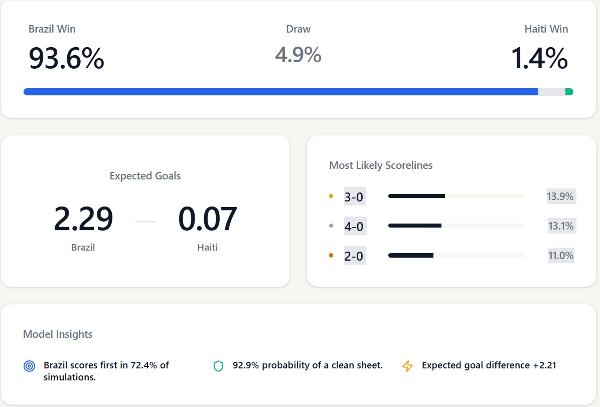
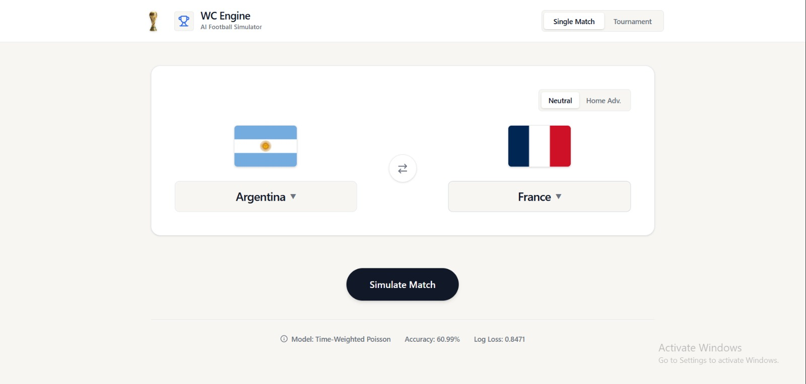
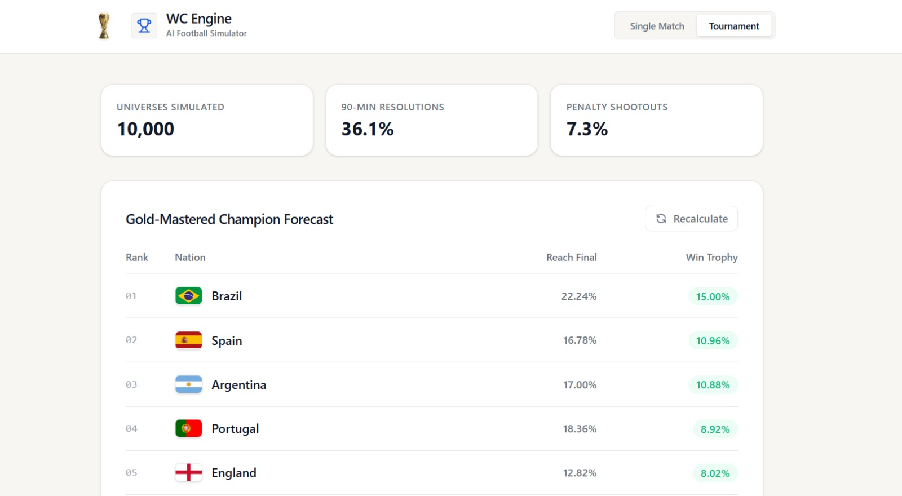
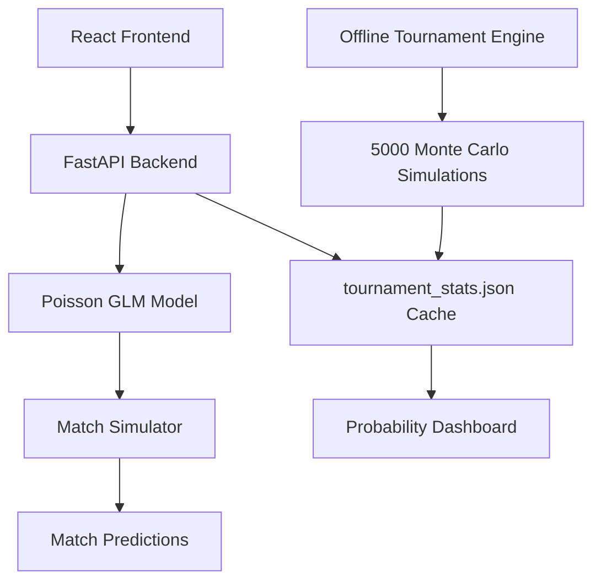

# FIFA World Cup 2026 Simulation Engine

> **From a simple match predictor to a full-scale World Cup simulator.**
>
> *A two-week journey through statistics, software engineering, debugging, probability, and countless football simulations.*

---

<p align="center">
  
</p>

---

## Live Demo

Frontend: <frontend URL>

Backend API: https://wc-engine-api.onrender.com

## Overview

This project started with a simple question:

> **Can I build a system that realistically simulates an entire FIFA World Cup tournament before it happens?**

At first, this sounded like a typical machine learning problem.

Train a model. Predict winners. Display probabilities.

Simple.

It wasn't.

The deeper I went, the more I realized that predicting football matches is only a small part of simulating an entire World Cup.

A tournament simulator must answer much harder questions:

* Who qualifies from each group?
* What happens when teams finish level on points?
* How do goal differences affect standings?
* What happens in extra time?
* What happens in penalty shootouts?
* How often does a team actually win the entire tournament?

A simple win/draw/loss classifier cannot answer those questions.

Over roughly two weeks, this project evolved from a standard machine learning experiment into a full-stack stochastic simulation engine capable of generating **5,000 complete World Cup universes** and estimating the probability of every team lifting the trophy.

---

# Project Highlights

### Features

✅ Single Match Predictor

✅ Full World Cup Tournament Simulator

✅ Poisson Goal Model

✅ Monte Carlo Tournament Simulation

✅ Group Stage Resolution

✅ Knockout Bracket Generation

✅ Extra Time Simulation

✅ Penalty Shootout Resolution

✅ FastAPI Backend

✅ React + Tailwind Frontend

✅ Interactive Probability Dashboard

✅ Team Leaderboards

✅ Expected Goals (xG-style probabilities)

✅ Most Likely Scoreline Predictions

✅ Tournament Champion Forecasting

---

# The Journey

## Phase 1 — The First Attempt

The project originally began as a traditional machine learning classification problem.

I experimented with:

* Logistic Regression
* HistGradientBoosting
* XGBoost-style approaches
* Elo Rating Features
* Team Form Features
* Historical Win/Loss Statistics

The goal was simple:

Predict:

* Home Win
* Draw
* Away Win

and measure accuracy.

### The Problem

Classification models can tell you:

> "Brazil has a 65% chance to win."

But they cannot naturally tell you:

> "Brazil is most likely to win 2-0."

And that distinction matters enormously.

A World Cup simulator needs actual scorelines.

Without goals:

* Goal Difference cannot be calculated
* Group rankings become impossible
* Knockout progression becomes unrealistic
* Extra Time probabilities cannot be modeled properly

I had built a model that could predict winners.

I had not built a model that could simulate football.

That realization changed everything.

---

## Phase 2 — The Pivot

At this point I abandoned the classification approach completely.

Instead of predicting match outcomes directly, I decided to predict goals.

This led to the project's biggest turning point:

### Poisson Generalized Linear Models (GLM)

Using Statsmodels, I trained a Poisson model on historical international football results.

Instead of asking:

> Who wins?

The model asks:

> How many goals should each team score?

Once expected goals are calculated:

* 0 goals
* 1 goal
* 2 goals
* 3 goals
* 4 goals

can all be assigned probabilities using Poisson mathematics.

This allows the system to generate a complete score probability matrix.

Example:

| Score | Probability |
| ----- | ----------- |
| 1-0   | 9.8%        |
| 2-0   | 11.4%       |
| 2-1   | 10.1%       |
| 1-1   | 8.9%        |

From this matrix:

* Home Win %
* Draw %
* Away Win %

can all be derived naturally.

The simulator finally had something classification models could never provide:

**realistic football scores.**

---

# The Hardest Problem: Time

Once the Poisson model worked, a much bigger issue appeared.

Historical football data spans decades.

Should a match from 1998 matter as much as one from 2025?

Obviously not.

But how much less should it matter?

This became the hardest part of the project.

---

## Attempt 1 — No Time Decay

Every match was treated equally.

Result:

* Old powerhouse teams became overvalued.
* Ancient performances continued influencing predictions.
* The model felt disconnected from modern football.

Clearly wrong.

---

## Attempt 2 — Aggressive 4-Year Decay

Then I tried a strong recency weighting.

Only recent matches mattered significantly.

This created a completely different problem.

### Argentina Anomaly

Argentina's recent run was extraordinary.

World Cup winners.

Copa America winners.

Massive unbeaten streak.

The model became obsessed with Argentina.

Tournament win probabilities exploded.

They became unrealistically stronger than every other elite nation.

Mathematically correct.

Practically wrong.

---

## Final Solution — 8-Year Exponential Decay

After extensive testing and parameter sweeps, I settled on:

### 8-Year Exponential Time Decay

This created the balance I was looking for:

* Recent form still matters
* Historical strength still matters
* Long-term football pedigree remains relevant

The simulator finally felt realistic.

---

# Model Performance

Final evaluation metrics:

### Accuracy

**60.99%**

### Log Loss

**0.8471**

---

## Why Accuracy Isn't Everything

One lesson this project taught me:

> Accuracy is not the goal.

Football is inherently random.

A perfectly calibrated probability model can still be wrong.

Example:

If a model predicts:

* Brazil win → 90%
* Draw → 7%
* Opponent win → 3%

and the match ends in a draw,

the model is not necessarily bad.

The unlikely event simply happened.

A simulator's purpose is not to predict every individual match correctly.

Its purpose is to estimate probabilities realistically over thousands of possible futures.

That distinction changed how I think about predictive systems.

---

# Monte Carlo Tournament Engine

Once match simulation was complete, I built the tournament engine.

The engine:

1. Simulates every group stage match
2. Resolves group standings
3. Applies FIFA tiebreak rules
4. Generates knockout brackets
5. Simulates Round of 32
6. Simulates Round of 16
7. Simulates Quarterfinals
8. Simulates Semifinals
9. Simulates Final

Then repeats the entire process:

### 5,000 Times

Each run represents a different possible football universe.

The final probabilities are calculated from those universes.

Example:

| Team      | Win Tournament |
| --------- | -------------- |
| Brazil    | 15.0%          |
| Spain     | 11.0%          |
| Argentina | 10.9%          |

*(Insert latest leaderboard screenshot here)*

---

# Real Football Doesn't Read Models

One of the most interesting parts of the project was discovering where the model struggled.

These weren't bugs.

They were reminders that football is chaotic.

---

## Case Study #1

### Cape Verde vs Spain

### Model Prediction



The model strongly favored Spain.

### Actual Result

**Cape Verde 0 – 0 Spain**

A draw.

Despite Spain being massively favored.

Why?

Because even an 80% win probability still leaves room for the remaining 20%.

Football is low scoring.

One missed chance.

One great goalkeeper performance.

One lucky defensive block.

Everything changes.

---

## Case Study #2

### Cape Verde vs Uruguay

### Model Prediction



The model heavily favored Uruguay.

### Actual Result

**Cape Verde 2 – 2 Uruguay**

Another reminder that probability is not certainty.

The model correctly identified Uruguay as the stronger team.

The football match simply followed one of the lower-probability outcomes.

---

## Case Study #3

### Ecuador vs Curaçao

### Model Prediction



Ecuador were overwhelming favorites.

### Actual Result

**Ecuador 0 – 0 Curaçao**

This was particularly interesting.

The model expected Ecuador to score heavily.

Instead, Curaçao held firm and their goalkeeper delivered an exceptional performance.

The simulator cannot model:

* Individual brilliance
* Injuries
* Red cards
* Momentum swings
* Psychological pressure

Those are part of what makes football beautiful and frustrating.

---

# Example of a Strong Prediction

## Brazil vs Haiti

### Model Prediction



| Outcome    | Probability |
| ---------- | ----------- |
| Brazil Win | 93.6%       |
| Draw       | 4.9%        |
| Haiti Win  | 1.4%        |

Most likely scores:

| Score | Probability |
| ----- | ----------- |
| 3-0   | 13.9%       |
| 4-0   | 13.1%       |
| 2-0   | 11.0%       |

### Actual Result

**Brazil 3 – 0 Haiti**

A near-perfect prediction.

This is where probabilistic models shine.

Not by predicting every game perfectly,

but by making strong predictions when a significant quality gap exists.

---

# Training Data

The model was trained exclusively on historical international football matches.

### Training Cutoff

**June 10, 2026**

No FIFA World Cup 2026 matches were used during training.

This means every World Cup 2026 result acts as a genuine out-of-sample test.

Anyone can verify the model themselves by comparing predictions against actual World Cup matches.

---

# Software Engineering Lessons

This project was much more than machine learning.

A prediction model sitting in a notebook is not a product.

I had to build the surrounding system.

---

## Backend

### FastAPI

The backend serves:

* Team lists
* Match predictions
* Cached tournament forecasts
* Probability tables

Main responsibilities:

* Load trained model
* Serve match predictions
* Serve cached tournament forecasts
* Return structured JSON
* Manage API requests

---

## Frontend

### React + Tailwind CSS

The frontend provides:

* Single Match Predictor
* Tournament Simulator
* Interactive Dashboard
* Probability Visualizations
* Team Rankings

---

## Problems I Had To Solve

### State Management

Switching tabs initially erased simulation results.

Fixed by lifting state into the parent component.

---

### API Request Flooding

Repeated clicks generated multiple simulation requests.

This overloaded the backend.

Fixed using request locking and frontend safeguards.

---

### Repository Cleanup

The project accumulated dozens of experimental scripts.

By the end I archived:

* Old classifiers
* Data scrapers
* Failed experiments
* Diagnostic scripts

and kept production code isolated from research code.

---

# Architecture

```text
React Frontend
       │
       ▼
FastAPI Backend
       │
       ├── Match Prediction
       │         ▼
       │    Poisson Engine
       │
       └── Tournament Forecast
                 ▼
      Cached Monte Carlo Results
                 ▼
         Probability Dashboard
```

---

# Project Structure

```text
world-cup-engine/
│
├── assets/
│
├── backend/
│   ├── cache/
│   │   └── tournament_stats.json
│   ├── models/
│   └── src/
│
├── frontend/
│
└── README.md
```

---

## Production Optimization

The deployment artifact stores only the trained Poisson model coefficients rather than the full Statsmodels object. This reduced the production model size from hundreds of megabytes to roughly 20 KB while preserving identical prediction behavior.

---

### Deployment

The application is deployed using React, FastAPI, and Render.
Production optimizations were implemented to reduce memory usage,
improve startup time, and provide near-instant tournament forecasts.

### API Endpoints

| Endpoint | Description |
|-----------|-------------|
| `GET /api/teams` | Returns available national teams |
| `GET /api/simulate` | Returns scoreline and outcome probabilities for a match |
| `GET /api/tournament-stats` | Returns cached World Cup tournament forecasts generated from 5,000 Monte Carlo simulations |

## Cached Tournament Forecasts

Originally, every tournament forecast request triggered thousands of
Monte Carlo World Cup simulations in real time.

While statistically accurate, this approach introduced long response
times and unnecessary resource consumption in production.

To improve performance, tournament forecasts are now generated offline
using 5,000 complete World Cup simulations and stored as a cached JSON
artifact.

The API serves these cached probabilities instantly, providing the same
forecast results while dramatically reducing response time and server
load.

### Frontend

```bash
cd frontend

npm install

npm run dev
```

---

# What I Learned

This project taught me far more than football prediction.

It forced me to learn:

* Statistical Modeling
* Poisson Processes
* Probability Calibration
* Time Decay Systems
* Monte Carlo Simulation
* API Design
* FastAPI
* React State Management
* Frontend Architecture
* Backend Architecture
* Model Evaluation
* Software Refactoring
* Production Deployment Thinking

Most importantly, it taught me that building a model is only a small part of building a system.

The hardest work often happens around the model:

* data pipelines
* architecture
* debugging
* calibration
* user experience
* performance

---

# Final Thoughts

This was one of the most challenging projects I have worked on.

It took roughly two weeks of constant iteration, experimentation, refactoring, and debugging.

The final product is not a crystal ball.

It will get matches wrong.

It will occasionally underestimate underdogs.

It will sometimes crown the wrong tournament winner.

But that is not a failure of the simulator.

That uncertainty is the entire reason football remains unpredictable.

What started as curiosity became a deep dive into probability, statistics, software engineering, and simulation design.

Looking back, the most valuable outcome was never the final accuracy score.

It was learning how to take an idea, challenge its assumptions, rebuild it multiple times, and eventually turn it into a complete end-to-end application.

---

## Screenshots


### Home Dashboard


### Tournament Forecast

<p align="center">
  
</p>


---

### Architecture Diagram



**Built by Alan Ali**
**CSE/3rd year**
*World Cup 2026 Simulation Engine*
